# e2mail

Self-hosted, end-to-end encrypted e2Mail client. Speaks IMAP/SMTP to any mail
provider, stores PGP key material in a single SQLite file, and serves the SPA
and the API from a single Go binary in one container.

## Features

- **Any IMAP/SMTP server** — Gmail, Outlook, Fastmail, iCloud, QQ, custom
  domains, or a self-hosted mail server. Built-in adaptive table for common
  providers.
- **Multi-account** — manage multiple mail accounts in one session, with a
  Thunderbird/iOS-Mail-style sidebar folder tree, per-account unread badges,
  and a `/accounts` management page. Account IMAP/SMTP passwords are stored
  encrypted at rest (LUKS-style envelope encryption: a random DEK wraps all
  account passwords, itself wrapped by the first account's IMAP password).
- **End-to-end PGP** (OpenPGP.js, Ed25519) — generate, import, encrypt, sign,
  decrypt, verify. Multi-block / multi-key / armored-or-binary `.gpg` files
  are all parsed and re-armored before send.
- **Server-side keyring** — passphrases never leave the browser; the server
  only stores the user's Passphrase-encrypted private key blob.
- **Per-user contact keyrings** stored in SQLite, shared across browsers.
- **Real-time push** via IMAP IDLE → SSE on `/api/events` (multiplexes all
  accounts over a single SSE connection).
- **One-file storage** — `/data/e2Mail.db` (with WAL siblings). Legacy
  per-user JSON keyring files are auto-migrated on first boot.
- **Container env defaults** — IMAP/SMTP host & port can be pre-configured by
  the admin so users don't have to fill the advanced settings.
- **Secure by default** — `allowInsecureTls` is off unless explicitly enabled.

## Web UI

Sign-in only asks for email and password; IMAP/SMTP host and port can be
pre-filled by the admin through env vars, and the advanced panel stays
collapsed for everyone else.

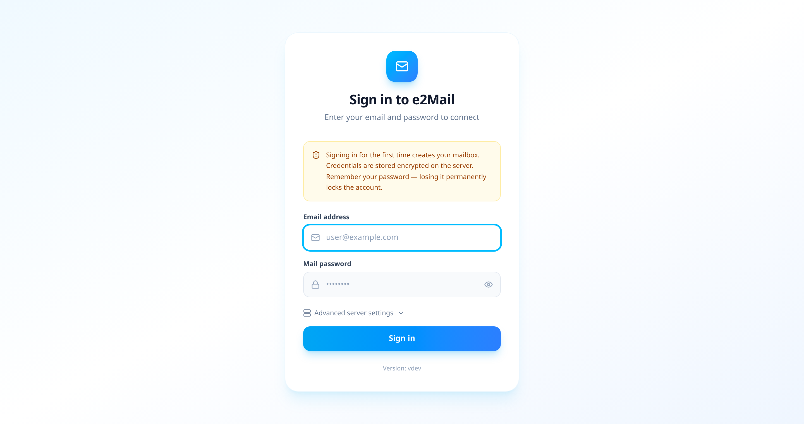

Everything account-related lives on one settings page — 2FA and password,
PGP keys, mail accounts, Sieve filters, and appearance — with a sidebar on
desktop and a scrollable tab strip on narrow screens.

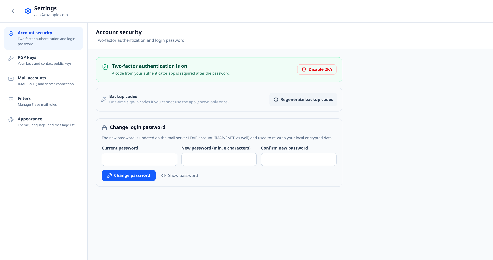

PGP key pairs are generated in the browser and backed up to the server only in
passphrase-encrypted form, so the same key can be picked up on another device
without the passphrase ever being uploaded. Contact public keys are imported
from files, pasted blocks, or a keyserver lookup.

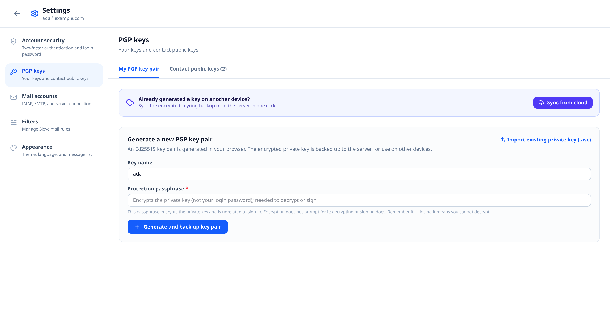

Several mail accounts can be managed in one session, each with its own
IMAP/SMTP endpoints, TLS flags, and encrypted-at-rest password.

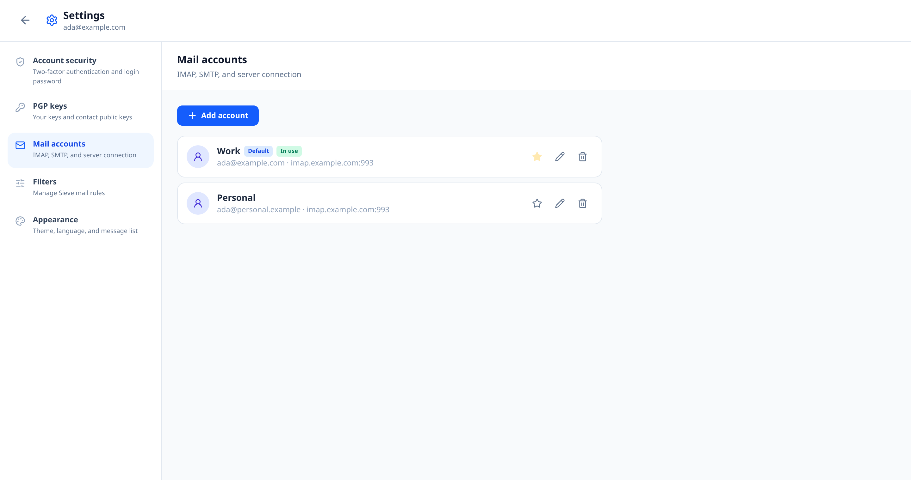

Sieve filters are edited as visual rules, and the generated script stays
visible so you can check exactly what gets uploaded to the server.

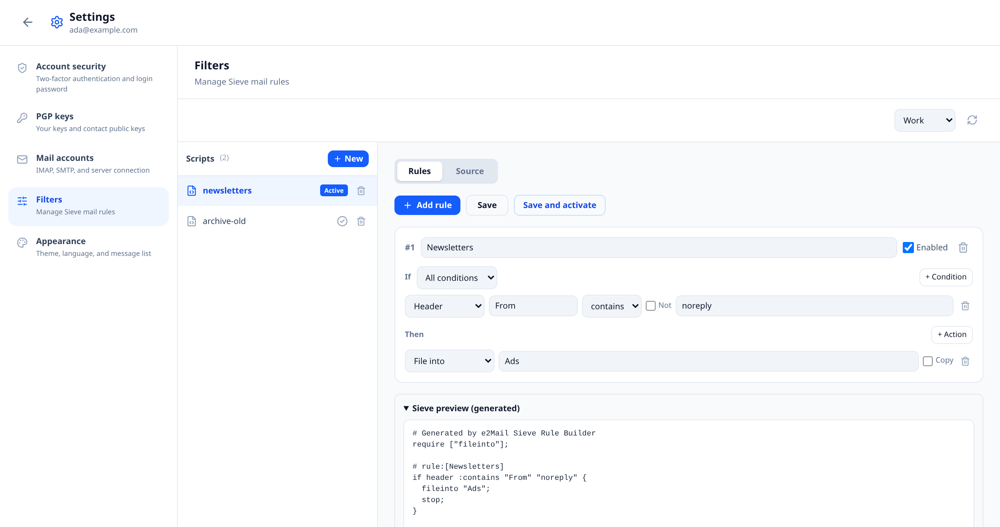

Theme, interface language, and message-vs-conversation list mode are chosen
under Appearance. All three are stored as server-side user preferences, so the
choices follow the account to another browser or device.

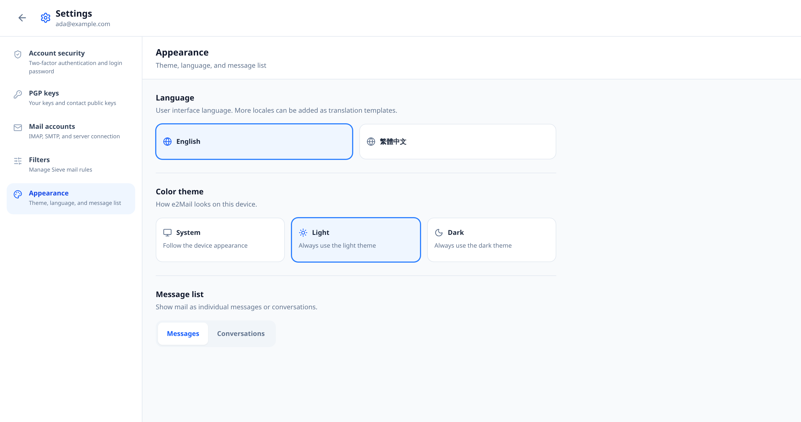

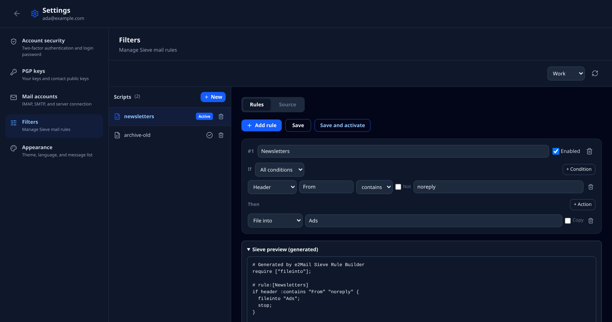

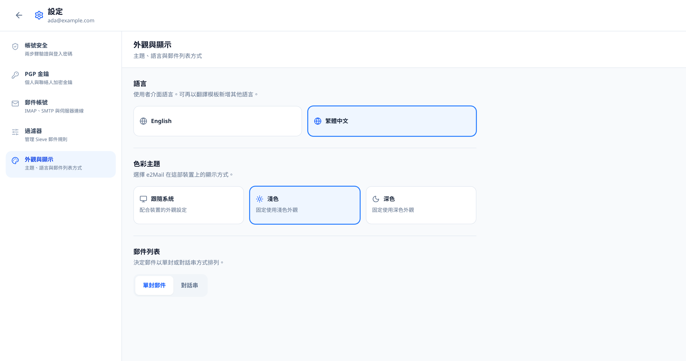

Every screen is built for phones as well as desktops:

<p>
  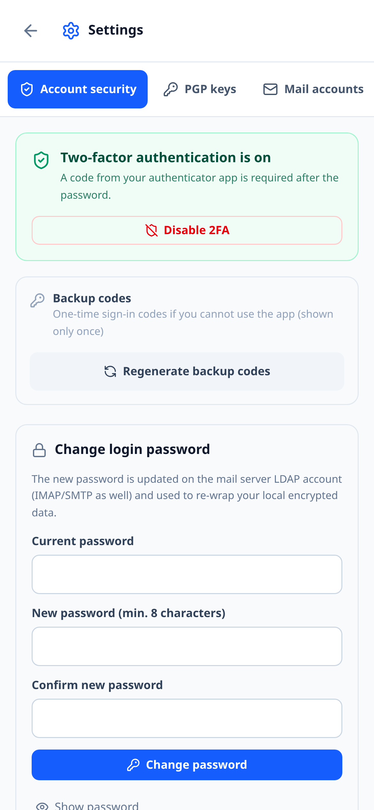
  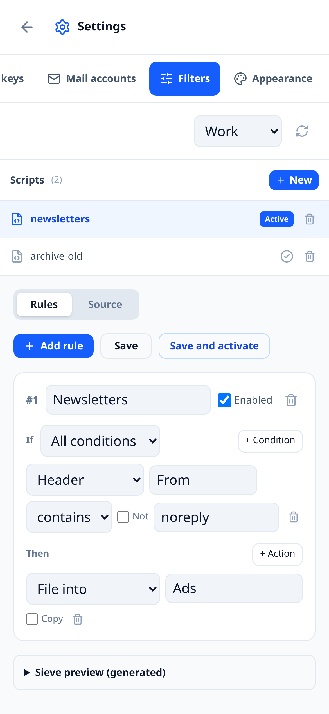
  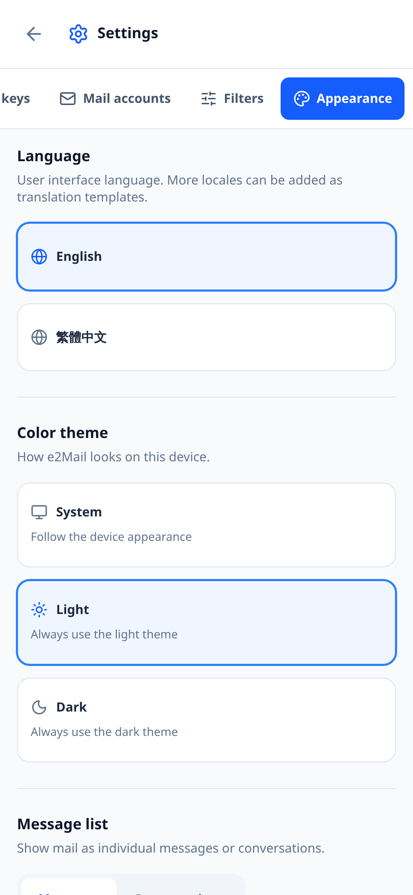
</p>

*Screenshots use sample accounts and keys.*

## Architecture

```
┌──────────────┐      HTTP      ┌──────────────────────────────────┐
│  Browser UI  │ ◀────────────▶ │  Single Go binary (chi) :8080     │
│  React + Vite│   /api/*       │  - serves embedded SPA (go:embed) │
└──────────────┘                │  - HTTP API                      │
                                │  - IMAP client pool + IDLE        │
                                │  - SMTP sender                   │
                                │  - Sessions (in-memory, AES)     │
                                │  - SQLite storage                │
                                └──────────────┬───────────────────┘
                                               │
                                               ▼
                                /data/e2Mail.db  (named volume)
```

The frontend `dist/` (React 19 + Vite 8 + Tailwind 4) is built during the Docker
image build and `go:embed`-ed into the backend binary (`backend/web`), so the
container runs a single process serving both the SPA and the API.

| Service  | Tech                                            | Port (host) |
|----------|-------------------------------------------------|-------------|
| e2Mail  | Go 1.26 + chi + modernc.org/sqlite, embeds the Vite build | `8080`      |

## Quick start

```bash
# Clone
git clone <repo-url> e2mail
cd e2mail

# Build & run
docker compose up -d --build

# Open
open http://localhost:8080      # e2Mail UI (SPA + API on one port)
curl http://localhost:8080/health   # health probe
```

On first launch, `/data/e2Mail.db` is created and any legacy
`/data/keyrings/*.json` files are auto-imported into the `personal_keyrings`
table.

## Configuration

Both defaults are loaded by the container from environment variables.
Uncomment in `docker-compose.yml` (or set via your orchestrator) to activate.

| Env var                   | Default | Purpose                                                 |
|---------------------------|---------|---------------------------------------------------------|
| `PORT`                    | `8080`  | Backend HTTP listen port                                |
| `DATA_DIR`                | `/data` | SQLite + keyring directory (must be on a persistent volume) |
| `SESSION_TTL_HOURS`       | `24`    | Idle session expiry (hours, cookie `Expires`/`MaxAge` 同步) |
| `SESSION_SECRET`          | (random)| 32-byte AES-GCM key for encrypting the per-session DEK at rest (raw 32 chars / base64 44 chars / hex 64 chars) |
| `COOKIE_SECURE`           | `true`  | Set `Secure` flag on `e2Mail_session` cookie (set `false` for plain HTTP dev) |
| `DEFAULT_IMAP_HOST`       | —       | Pre-fill IMAP host for users with custom domains        |
| `DEFAULT_IMAP_PORT`       | `993`   | Pre-fill IMAP port                                      |
| `DEFAULT_SMTP_HOST`       | —       | Pre-fill SMTP host                                      |
| `DEFAULT_SMTP_PORT`       | `587`   | Pre-fill SMTP port                                      |
| `DEFAULT_ALLOW_INSECURE_TLS` | `false` | Pre-fill "allow self-signed" checkbox (off by default) |
| `REQUIRE_2FA`             | `true`  | Enforce 2FA onboarding for new logins                   |
| `REQUIRE_PGP`             | `true`  | Enforce PGP key setup onboarding for new logins         |

The public endpoint `GET /api/server-config` exposes the defaults so the login
page can pre-populate the advanced settings panel.

## Version metadata

`Version`, `BuildTime` and `CommitHash` are baked in at image build time and
shown in the startup log and the sidebar footer of the UI. Defaults are
`vdev` / `timeless` / `sha-unknown`; tag builds (`.github/workflows/container.yml`)
inject the real values via Docker `--build-arg`:

```bash
docker build \
  --build-arg VERSION=v1.2.3 \
  --build-arg BUILD_TIME=$(date -u +'%Y-%m-%dT%H:%M:%SZ') \
  --build-arg COMMIT_HASH=$(git rev-parse HEAD) \
  .
```

## Storage

Everything user-private lives in one SQLite file:

- `contact_keys` — per-user PGP public keys for contacts (email, fingerprint,
  key ID, ASCII-armored key).
- `personal_keyrings` — per-user cloud-synced private keyring (passphrase-
  encrypted private key + public key + metadata).
- `accounts` — per-user mail account settings (IMAP/SMTP host/port/TLS flags);
  passwords are stored encrypted with a per-user DEK.
- `users` — per-user credential envelope (Argon2id salt + DEK wrapped by the
  master key derived from the first account's IMAP password).

WAL mode is enabled (`journal_mode=WAL`, `busy_timeout=5000`); the
`-shm` / `-wal` siblings accompany the main file inside the same
`data` named volume.

## Documentation

Per-feature design notes and implementation plans live in [`docs/`](docs/):

| Document | Scope | Status |
|----------|-------|--------|
| [`LDAP.md`](docs/LDAP.md) | Login password change through OpenBSD `ldapd` or OpenLDAP slapd (RFC 3062), including DEK re-wrap ordering and rollback | implemented |
| [`SIEVE.md`](docs/SIEVE.md) | ManageSieve integration and the visual rule builder | implemented |
| [`THREADS.md`](docs/THREADS.md) | Gmail-style conversation grouping from IMAP headers | implemented |
| [`MultiAccounts.md`](docs/MultiAccounts.md) | Multiple mail accounts in one session | implemented |
| [`MAIL-RENDER.md`](docs/MAIL-RENDER.md) | HTML mail sanitising, fit-to-width, remote-image blocking | implemented |
| [`CONTACTS.md`](docs/CONTACTS.md) | Per-user address book with vCard/CSV import | draft |

## Development

### Backend
```bash
cd backend
go test ./...       # add tests here
go run ./cmd/server
```

### Frontend
```bash
cd frontend
npm install
npm run dev         # http://localhost:5173, proxies /api to :8080
npm run build
```

`http://localhost:5173/preview.html` renders the settings page on its own with
a stubbed session and canned API responses, so layout (including phone widths)
can be checked without a backend or a real mail server. Append `?2fa=on` to see
the enabled-2FA state. The file is dev-only — `vite build` only emits
`index.html`, so it never reaches the container image.

The README screenshots are regenerated from that preview with
`node scripts/screenshots.mjs` (needs a running dev server and a Playwright
Chromium; see the header of the script).

## Security notes

- Private keys are encrypted at rest with the user's passphrase; the server
  never sees the passphrase.
- Mail account passwords are never stored in plaintext: each user has a random
  DEK that encrypts all account passwords, and the DEK itself is AES-GCM
  wrapped by a master key derived (Argon2id) from the first account's IMAP
  password. Losing that password permanently locks all stored account secrets.
- Sessions hold only the in-memory DEK (AES-GCM encrypted); setting
  `SESSION_SECRET` is recommended for multi-instance deployments.
- TLS is mandatory by default (`allowInsecureTls = false`). Only enable
  self-signed certs via env when targeting a test environment.
- Requests hit the Go server directly (no nginx/proxy in front), so large PGP
  key imports of dozens of keys aren't rejected by a proxy size limit.

## License

MIT (or your preference — see `LICENSE` once added).
